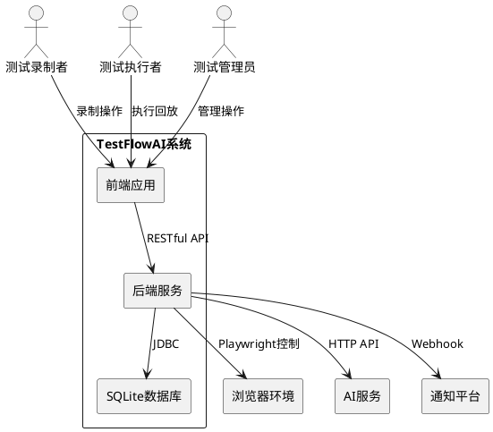
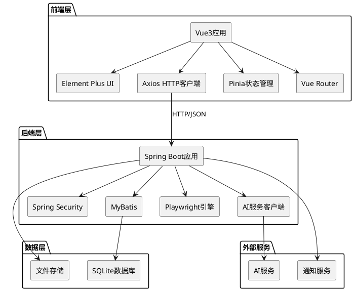

# TestFlowAI 技术设计文档

## 1. 实现模型

### 1.1 上下文视图

TestFlowAI系统采用前后端分离架构，前端使用现代Web技术栈构建美观大气的用户界面，后端使用Java 17 + MyBatis提供RESTful API服务，数据持久化使用SQLite本地文件数据库。

**系统上下文图**：



### 1.2 服务/组件总体架构

**技术栈选型**：

| 层次 | 技术选型 | 说明 |
|------|---------|------|
| 前端框架 | Vue 3 + TypeScript | 现代化响应式框架，类型安全 |
| UI组件库 | Element Plus | 美观大气的企业级UI组件 |
| 样式方案 | Tailwind CSS + SCSS | 原子化CSS + 预处理器 |
| 图表库 | ECharts | 数据可视化 |
| 后端框架 | Spring Boot 3.x | Java 17 + Spring AI生态 |
| ORM框架 | MyBatis 3.x | 灵活的SQL映射框架 |
| 数据库 | SQLite 3.x | 轻量级文件数据库 |
| 浏览器控制 | Playwright Java | 跨浏览器自动化 |
| AI集成 | OpenAI SDK / Claude SDK | LLM API调用 |
| 认证方案 | JWT + Spring Security | 无状态认证 |

**系统架构图**：



### 1.3 实现设计文档

#### 1.3.1 前端模块设计

**目录结构**：

```
frontend/
├── src/
│   ├── main.ts                 # 应用入口
│   ├── App.vue                 # 根组件
│   ├── router/                 # 路由配置
│   │   └── index.ts
│   ├── stores/                 # Pinia状态管理
│   │   ├── user.ts            # 用户状态
│   │   ├── testflow.ts        # 测试流状态
│   │   └── execution.ts       # 执行状态
│   ├── views/                  # 页面组件
│   │   ├── Login.vue          # 登录页
│   │   ├── Dashboard.vue      # 仪表盘
│   │   ├── TestFlowList.vue   # 测试流列表
│   │   ├── TestFlowEditor.vue # 测试流编辑器
│   │   ├── Execution.vue      # 执行回放
│   │   ├── Report.vue         # 测试报告
│   │   └── UserManagement.vue # 用户管理
│   ├── components/             # 可复用组件
│   │   ├── TestStepCard.vue   # 测试步骤卡片
│   │   ├── JsonEditor.vue     # JSON编辑器
│   │   ├── ExecutionLog.vue   # 执行日志
│   │   └── ReportChart.vue    # 报告图表
│   ├── api/                    # API接口
│   │   ├── auth.ts            # 认证接口
│   │   ├── testflow.ts        # 测试流接口
│   │   ├── execution.ts       # 执行接口
│   │   └── user.ts            # 用户接口
│   ├── utils/                  # 工具函数
│   │   ├── request.ts         # HTTP请求封装
│   │   └── validation.ts      # 数据验证
│   └── styles/                 # 样式文件
│       ├── main.scss          # 主样式
│       └── variables.scss     # 变量定义
├── public/
│   └── index.html
└── package.json
```

**核心页面设计**：

1. **登录页（Login.vue）**
   - 美观的登录表单，支持用户名/密码登录
   - 表单验证，错误提示
   - 响应式布局，支持移动端

2. **仪表盘（Dashboard.vue）**
   - 统计卡片：测试流总数、执行次数、通过率
   - 最近执行的测试流列表
   - ECharts图表：执行趋势、通过率分布

3. **测试流列表（TestFlowList.vue）**
   - 表格展示测试流，支持搜索、筛选、排序
   - 操作按钮：编辑、执行、删除、导出
   - 标签筛选，批量操作

4. **测试流编辑器（TestFlowEditor.vue）**
   - 左侧：步骤列表，拖拽排序
   - 中间：JSON编辑器，实时预览
   - 右侧：步骤属性面板
   - 支持条件分支、循环的可视化编辑

5. **执行回放（Execution.vue）**
   - 实时显示执行进度
   - 步骤执行日志，高亮当前步骤
   - 截图预览，错误提示
   - 支持暂停、继续、停止

6. **测试报告（Report.vue）**
   - 统计摘要：总数、通过、失败、耗时
   - 详细结果列表，展开查看步骤详情
   - 截图对比，历史趋势图
   - 导出按钮：HTML、PDF、JSON

7. **用户管理（UserManagement.vue）**
   - 用户列表表格，支持搜索
   - 创建/编辑用户对话框
   - 角色分配，权限配置
   - 审计日志查看

#### 1.3.2 后端模块设计

**目录结构**：

```
backend/
├── src/main/java/com/testflowai/
│   ├── TestFlowAiApplication.java    # 应用入口
│   ├── config/                       # 配置类
│   │   ├── SecurityConfig.java      # 安全配置
│   │   ├── MyBatisConfig.java       # MyBatis配置
│   │   └── PlaywrightConfig.java    # Playwright配置
│   ├── controller/                   # 控制器
│   │   ├── AuthController.java      # 认证控制器
│   │   ├── TestFlowController.java  # 测试流控制器
│   │   ├── ExecutionController.java # 执行控制器
│   │   ├── ReportController.java    # 报告控制器
│   │   └── UserController.java      # 用户控制器
│   ├── service/                      # 服务层
│   │   ├── AuthService.java         # 认证服务
│   │   ├── TestFlowService.java     # 测试流服务
│   │   ├── ExecutionService.java    # 执行服务
│   │   ├── ReportService.java       # 报告服务
│   │   ├── UserService.java         # 用户服务
│   │   ├── PlaybackEngine.java      # 回放引擎
│   │   └── AiService.java           # AI服务
│   ├── mapper/                       # MyBatis Mapper
│   │   ├── UserMapper.java          # 用户Mapper
│   │   ├── RoleMapper.java          # 角色Mapper
│   │   ├── TestFlowMapper.java      # 测试流Mapper
│   │   ├── ExecutionMapper.java     # 执行Mapper
│   │   └── ReportMapper.java        # 报告Mapper
│   ├── entity/                       # 实体类
│   │   ├── User.java                # 用户实体
│   │   ├── Role.java                # 角色实体
│   │   ├── Permission.java          # 权限实体
│   │   ├── TestFlow.java            # 测试流实体
│   │   ├── Execution.java           # 执行实体
│   │   └── Report.java              # 报告实体
│   ├── dto/                          # 数据传输对象
│   │   ├── LoginRequest.java        # 登录请求
│   │   ├── TestFlowDto.java         # 测试流DTO
│   │   └── ExecutionResultDto.java  # 执行结果DTO
│   ├── vo/                           # 视图对象
│   │   ├── UserVo.java              # 用户VO
│   │   └── ReportVo.java            # 报告VO
│   ├── enums/                        # 枚举类
│   │   ├── StepType.java            # 步骤类型枚举
│   │   ├── ExecutionStatus.java     # 执行状态枚举
│   │   └── UserRole.java            # 用户角色枚举
│   ├── exception/                    # 异常处理
│   │   ├── GlobalExceptionHandler.java
│   │   └── BusinessException.java
│   └── util/                         # 工具类
│       ├── JwtUtil.java             # JWT工具
│       ├── JsonUtil.java            # JSON工具
│       └── FileUtil.java            # 文件工具
├── src/main/resources/
│   ├── application.yml              # 应用配置
│   ├── mapper/                      # MyBatis XML
│   │   ├── UserMapper.xml
│   │   ├── TestFlowMapper.xml
│   │   └── ExecutionMapper.xml
│   └── db/
│       └── schema.sql               # 数据库初始化脚本
└── pom.xml                          # Maven配置
```

**核心服务设计**：

1. **认证服务（AuthService）**
   - 用户登录验证，生成JWT令牌
   - 密码BCrypt加密/验证
   - 权限验证，角色检查

2. **测试流服务（TestFlowService）**
   - CRUD操作，版本管理
   - JSON格式验证
   - 导入/导出功能

3. **执行服务（ExecutionService）**
   - 调用回放引擎执行测试流
   - 管理执行队列，并发控制
   - 保存执行结果

4. **回放引擎（PlaybackEngine）**
   - 初始化Playwright浏览器
   - 解析测试流JSON，执行步骤
   - 智能等待，选择器尝试
   - AI修复，断言验证
   - 截图保存，日志记录

5. **AI服务（AiService）**
   - 调用LLM API分析DOM
   - 生成备用选择器
   - 错误重试，超时控制

6. **报告服务（ReportService）**
   - 生成HTML/PDF/JSON报告
   - 统计计算，历史对比
   - 推送到通知平台

7. **用户服务（UserService）**
   - 用户CRUD，角色分配
   - RBAC权限验证
   - 审计日志记录

---

## 2. 接口设计

### 2.1 总体设计

**API设计原则**：
- RESTful风格，资源导向
- 统一响应格式：`{ code, message, data, timestamp }`
- JWT认证，请求头携带：`Authorization: Bearer {token}`
- 统一异常处理，返回标准错误码

**认证机制**：
- 登录成功返回JWT令牌
- 令牌有效期：24小时
- 刷新令牌机制：7天
- 权限验证：基于RBAC，检查用户角色权限

### 2.2 接口清单

#### 2.2.1 认证接口

**POST /api/auth/login**
- 功能：用户登录
- 请求体：`{ username, password }`
- 响应：`{ token, refreshToken, user: { userId, username, roles } }`
- 权限：无

**POST /api/auth/logout**
- 功能：用户登出
- 请求头：`Authorization: Bearer {token}`
- 响应：`{ success: true }`
- 权限：已登录用户

**POST /api/auth/refresh**
- 功能：刷新令牌
- 请求体：`{ refreshToken }`
- 响应：`{ token, refreshToken }`
- 权限：无

#### 2.2.2 测试流接口

**GET /api/testflows**
- 功能：查询测试流列表
- 参数：`page, size, keyword, tag`
- 响应：`{ total, items: [TestFlowDto] }`
- 权限：`testflow:read`

**GET /api/testflows/{id}**
- 功能：查询单个测试流
- 响应：`TestFlowDto`
- 权限：`testflow:read`

**POST /api/testflows**
- 功能：创建测试流
- 请求体：`TestFlowDto`
- 响应：`{ testId }`
- 权限：`testflow:create`

**PUT /api/testflows/{id}**
- 功能：更新测试流
- 请求体：`TestFlowDto`
- 响应：`{ success: true }`
- 权限：`testflow:update`

**DELETE /api/testflows/{id}**
- 功能：删除测试流
- 响应：`{ success: true }`
- 权限：`testflow:delete`

**POST /api/testflows/import**
- 功能：导入测试流JSON
- 请求体：`multipart/form-data (file)`
- 响应：`{ testId }`
- 权限：`testflow:create`

**GET /api/testflows/{id}/export**
- 功能：导出测试流JSON
- 响应：`application/json (file download)`
- 权限：`testflow:read`

#### 2.2.3 执行接口

**POST /api/executions**
- 功能：启动测试流执行
- 请求体：`{ testId, mode, variables, dataSource }`
- 响应：`{ executionId }`
- 权限：`execution:execute`

**GET /api/executions/{id}**
- 功能：查询执行结果
- 响应：`ExecutionResultDto`
- 权限：`execution:read`

**GET /api/executions/{id}/logs**
- 功能：查询执行日志（实时）
- 响应：`Server-Sent Events (SSE)`
- 权限：`execution:read`

**POST /api/executions/{id}/stop**
- 功能：停止执行
- 响应：`{ success: true }`
- 权限：`execution:execute`

**GET /api/executions**
- 功能：查询执行历史
- 参数：`page, size, testId, status, startTime, endTime`
- 响应：`{ total, items: [ExecutionResultDto] }`
- 权限：`execution:read`

#### 2.2.4 报告接口

**GET /api/reports/{executionId}**
- 功能：查询测试报告
- 响应：`ReportVo`
- 权限：`report:read`

**GET /api/reports/{executionId}/export**
- 功能：导出报告
- 参数：`format (html|pdf|json)`
- 响应：`application/octet-stream (file download)`
- 权限：`report:read`

**POST /api/reports/{executionId}/notify**
- 功能：推送报告到通知平台
- 请求体：`{ platform, config }`
- 响应：`{ success: true }`
- 权限：`report:read`

**GET /api/reports/statistics**
- 功能：查询报告统计
- 参数：`startTime, endTime, group`
- 响应：`{ totalCases, passedRate, avgDuration, trend }`
- 权限：`report:read`

#### 2.2.5 用户管理接口

**GET /api/users**
- 功能：查询用户列表
- 参数：`page, size, keyword, status`
- 响应：`{ total, items: [UserVo] }`
- 权限：`user:read`

**GET /api/users/{id}**
- 功能：查询单个用户
- 响应：`UserVo`
- 权限：`user:read`

**POST /api/users**
- 功能：创建用户
- 请求体：`{ username, password, email, roles }`
- 响应：`{ userId }`
- 权限：`user:create`

**PUT /api/users/{id}**
- 功能：更新用户
- 请求体：`{ email, roles, status }`
- 响应：`{ success: true }`
- 权限：`user:update`

**DELETE /api/users/{id}**
- 功能：删除用户
- 响应：`{ success: true }`
- 权限：`user:delete`

**PUT /api/users/{id}/password**
- 功能：修改密码
- 请求体：`{ oldPassword, newPassword }`
- 响应：`{ success: true }`
- 权限：已登录用户（只能修改自己的密码）

**PUT /api/users/{id}/roles**
- 功能：分配角色
- 请求体：`{ roles: [roleId] }`
- 响应：`{ success: true }`
- 权限：`user:update`

#### 2.2.6 角色权限接口

**GET /api/roles**
- 功能：查询角色列表
- 响应：`[Role]`
- 权限：`role:read`

**GET /api/permissions**
- 功能：查询权限列表
- 响应：`[Permission]`
- 权限：`permission:read`

**GET /api/audit-logs**
- 功能：查询审计日志
- 参数：`page, size, userId, operation, startTime, endTime`
- 响应：`{ total, items: [AuditLog] }`
- 权限：`audit:read`

---

## 3. 数据模型

### 3.1 设计目标

**数据库选型**：
- **默认数据库**：SQLite（轻量级文件数据库，适合开发和小规模部署）
- **生产环境支持**：MySQL 8.0+、PostgreSQL 12+（适合大规模生产环境）

**数据库配置**：
- SQLite：数据文件 `data/testflowai.db`，无需独立数据库服务
- MySQL：需配置连接池，支持主从复制、读写分离
- PostgreSQL：需配置连接池，支持JSONB类型存储

**数据类型映射**：

| 逻辑类型 | SQLite | MySQL | PostgreSQL |
|---------|--------|-------|------------|
| 主键ID | VARCHAR(36) | VARCHAR(36) | VARCHAR(36) |
| 字符串 | VARCHAR(n) | VARCHAR(n) | VARCHAR(n) |
| 长文本 | TEXT | TEXT | TEXT |
| 整数 | INTEGER | INT | INTEGER |
| 小整数 | TINYINT | TINYINT | SMALLINT |
| 时间戳 | TIMESTAMP | DATETIME | TIMESTAMP |
| JSON | TEXT | JSON | JSONB |

**设计原则**：
1. 规范化设计，减少数据冗余
2. 合理索引，优化查询性能
3. 外键约束，保证数据一致性
4. 软删除机制，支持数据恢复
5. 时间戳字段，支持审计追踪
6. 数据库无关性设计，支持多数据库切换

### 3.2 模型实现

#### 3.2.1 用户相关表

**用户表（t_user）**：

| 字段名 | 类型 | 约束 | 说明 |
|--------|------|------|------|
| user_id | VARCHAR(36) | PRIMARY KEY | 用户ID（UUID） |
| username | VARCHAR(50) | UNIQUE, NOT NULL | 用户名 |
| password | VARCHAR(100) | NOT NULL | 密码（BCrypt加密） |
| email | VARCHAR(100) | UNIQUE | 邮箱 |
| status | VARCHAR(20) | NOT NULL, DEFAULT 'active' | 状态（active/disabled） |
| last_login_at | TIMESTAMP | | 最后登录时间 |
| created_at | TIMESTAMP | NOT NULL | 创建时间 |
| updated_at | TIMESTAMP | NOT NULL | 更新时间 |
| deleted_at | TIMESTAMP | | 删除时间 |
| deleted | TINYINT | NOT NULL, DEFAULT 0 | 软删除标记（1-删除，0-未删除） |
| created_by | VARCHAR(36) | | 创建者 |
| updated_by | VARCHAR(36) | | 更新者 |
| deleted_by | VARCHAR(36) | | 删除者 |

索引：
- `idx_user_username` ON (username)
- `idx_user_email` ON (email)
- `idx_user_status` ON (status)

**角色表（t_role）**：

| 字段名 | 类型 | 约束 | 说明 |
|--------|------|------|------|
| role_id | VARCHAR(36) | PRIMARY KEY | 角色ID（UUID） |
| role_name | VARCHAR(50) | UNIQUE, NOT NULL | 角色名称 |
| display_name | VARCHAR(100) | NOT NULL | 显示名称 |
| description | VARCHAR(200) | | 描述 |
| created_at | TIMESTAMP | NOT NULL | 创建时间 |
| updated_at | TIMESTAMP | NOT NULL | 更新时间 |
| deleted_at | TIMESTAMP | | 删除时间 |
| deleted | TINYINT | NOT NULL, DEFAULT 0 | 软删除标记（1-删除，0-未删除） |
| created_by | VARCHAR(36) | | 创建者 |
| updated_by | VARCHAR(36) | | 更新者 |
| deleted_by | VARCHAR(36) | | 删除者 |

**权限表（t_permission）**：

| 字段名 | 类型 | 约束 | 说明 |
|--------|------|------|------|
| permission_id | VARCHAR(36) | PRIMARY KEY | 权限ID（UUID） |
| permission_code | VARCHAR(100) | UNIQUE, NOT NULL | 权限代码 |
| permission_name | VARCHAR(100) | NOT NULL | 权限名称 |
| resource | VARCHAR(50) | NOT NULL | 资源类型 |
| action | VARCHAR(20) | NOT NULL | 操作类型 |
| description | VARCHAR(200) | | 描述 |
| created_at | TIMESTAMP | NOT NULL | 创建时间 |
| updated_at | TIMESTAMP | NOT NULL | 更新时间 |
| deleted_at | TIMESTAMP | | 删除时间 |
| deleted | TINYINT | NOT NULL, DEFAULT 0 | 软删除标记（1-删除，0-未删除） |
| created_by | VARCHAR(36) | | 创建者 |
| updated_by | VARCHAR(36) | | 更新者 |
| deleted_by | VARCHAR(36) | | 删除者 |

**用户角色关联表（t_user_role）**：

| 字段名 | 类型 | 约束 | 说明 |
|--------|------|------|------|
| user_id | VARCHAR(36) | FOREIGN KEY | 用户ID |
| role_id | VARCHAR(36) | FOREIGN KEY | 角色ID |
| assigned_at | TIMESTAMP | NOT NULL | 分配时间 |
| created_at | TIMESTAMP | NOT NULL | 创建时间 |
| updated_at | TIMESTAMP | NOT NULL | 更新时间 |
| deleted_at | TIMESTAMP | | 删除时间 |
| deleted | TINYINT | NOT NULL, DEFAULT 0 | 软删除标记（1-删除，0-未删除） |
| created_by | VARCHAR(36) | | 创建者 |
| updated_by | VARCHAR(36) | | 更新者 |
| deleted_by | VARCHAR(36) | | 删除者 |

主键：PRIMARY KEY (user_id, role_id)

**角色权限关联表（t_role_permission）**：

| 字段名 | 类型 | 约束 | 说明 |
|--------|------|------|------|
| role_id | VARCHAR(36) | FOREIGN KEY | 角色ID |
| permission_id | VARCHAR(36) | FOREIGN KEY | 权限ID |
| created_at | TIMESTAMP | NOT NULL | 创建时间 |
| updated_at | TIMESTAMP | NOT NULL | 更新时间 |
| deleted_at | TIMESTAMP | | 删除时间 |
| deleted | TINYINT | NOT NULL, DEFAULT 0 | 软删除标记（1-删除，0-未删除） |
| created_by | VARCHAR(36) | | 创建者 |
| updated_by | VARCHAR(36) | | 更新者 |
| deleted_by | VARCHAR(36) | | 删除者 |

主键：PRIMARY KEY (role_id, permission_id)

**角色继承表（t_role_inheritance）**：

| 字段名 | 类型 | 约束 | 说明 |
|--------|------|------|------|
| child_role_id | VARCHAR(36) | FOREIGN KEY | 子角色ID |
| parent_role_id | VARCHAR(36) | FOREIGN KEY | 父角色ID |
| created_at | TIMESTAMP | NOT NULL | 创建时间 |
| updated_at | TIMESTAMP | NOT NULL | 更新时间 |
| deleted_at | TIMESTAMP | | 删除时间 |
| deleted | TINYINT | NOT NULL, DEFAULT 0 | 软删除标记（1-删除，0-未删除） |
| created_by | VARCHAR(36) | | 创建者 |
| updated_by | VARCHAR(36) | | 更新者 |
| deleted_by | VARCHAR(36) | | 删除者 |

主键：PRIMARY KEY (child_role_id, parent_role_id)

**审计日志表（t_audit_log）**：

| 字段名 | 类型 | 约束 | 说明 |
|--------|------|------|------|
| log_id | VARCHAR(36) | PRIMARY KEY | 日志ID（UUID） |
| user_id | VARCHAR(36) | NOT NULL | 用户ID |
| username | VARCHAR(50) | NOT NULL | 用户名 |
| operation | VARCHAR(50) | NOT NULL | 操作类型 |
| resource | VARCHAR(50) | | 资源类型 |
| resource_id | VARCHAR(36) | | 资源ID |
| details | TEXT | | 操作详情（JSON） |
| ip_address | VARCHAR(50) | | IP地址 |
| timestamp | TIMESTAMP | NOT NULL | 操作时间 |
| result | VARCHAR(20) | NOT NULL | 操作结果（success/failure） |
| created_at | TIMESTAMP | NOT NULL | 创建时间 |
| updated_at | TIMESTAMP | NOT NULL | 更新时间 |
| deleted_at | TIMESTAMP | | 删除时间 |
| deleted | TINYINT | NOT NULL, DEFAULT 0 | 软删除标记（1-删除，0-未删除） |
| created_by | VARCHAR(36) | | 创建者 |
| updated_by | VARCHAR(36) | | 更新者 |
| deleted_by | VARCHAR(36) | | 删除者 |

索引：
- `idx_audit_user` ON (user_id)
- `idx_audit_operation` ON (operation)
- `idx_audit_timestamp` ON (timestamp)

#### 3.2.2 测试流相关表

**测试流表（t_testflow）**：

| 字段名 | 类型 | 约束 | 说明 |
|--------|------|------|------|
| test_id | VARCHAR(100) | PRIMARY KEY | 测试流ID |
| title | VARCHAR(100) | NOT NULL | 标题 |
| version | VARCHAR(20) | NOT NULL | 版本号 |
| app_url | VARCHAR(500) | | 应用URL |
| steps | TEXT | NOT NULL | 步骤JSON |
| variables | TEXT | | 变量JSON |
| tags | TEXT | | 标签JSON |
| expected_report | TEXT | | 预期报告JSON |
| created_at | TIMESTAMP | NOT NULL | 创建时间 |
| updated_at | TIMESTAMP | NOT NULL | 更新时间 |
| deleted_at | TIMESTAMP | | 删除时间 |
| deleted | TINYINT | NOT NULL, DEFAULT 0 | 软删除标记（1-删除，0-未删除） |
| created_by | VARCHAR(36) | | 创建者 |
| updated_by | VARCHAR(36) | | 更新者 |
| deleted_by | VARCHAR(36) | | 删除者 |

索引：
- `idx_testflow_title` ON (title)
- `idx_testflow_created` ON (created_at)

**测试流版本表（t_testflow_version）**：

| 字段名 | 类型 | 约束 | 说明 |
|--------|------|------|------|
| version_id | VARCHAR(36) | PRIMARY KEY | 版本ID（UUID） |
| test_id | VARCHAR(100) | FOREIGN KEY | 测试流ID |
| version | VARCHAR(20) | NOT NULL | 版本号 |
| steps | TEXT | NOT NULL | 步骤JSON |
| variables | TEXT | | 变量JSON |
| created_at | TIMESTAMP | NOT NULL | 创建时间 |
| updated_at | TIMESTAMP | NOT NULL | 更新时间 |
| deleted_at | TIMESTAMP | | 删除时间 |
| deleted | TINYINT | NOT NULL, DEFAULT 0 | 软删除标记（1-删除，0-未删除） |
| created_by | VARCHAR(36) | | 创建者 |
| updated_by | VARCHAR(36) | | 更新者 |
| deleted_by | VARCHAR(36) | | 删除者 |

索引：
- `idx_version_test` ON (test_id)

#### 3.2.3 执行相关表

**执行记录表（t_execution）**：

| 字段名 | 类型 | 约束 | 说明 |
|--------|------|------|------|
| execution_id | VARCHAR(36) | PRIMARY KEY | 执行ID（UUID） |
| test_id | VARCHAR(100) | FOREIGN KEY | 测试流ID |
| mode | VARCHAR(20) | NOT NULL | 执行模式 |
| status | VARCHAR(20) | NOT NULL | 执行状态 |
| start_time | TIMESTAMP | NOT NULL | 开始时间 |
| end_time | TIMESTAMP | | 结束时间 |
| total_steps | INT | NOT NULL | 总步骤数 |
| passed_steps | INT | NOT NULL | 通过步骤数 |
| failed_steps | INT | NOT NULL | 失败步骤数 |
| input | TEXT | | 执行输入JSON |
| output | TEXT | | 执行输出JSON |
| step_results | TEXT | | 步骤结果JSON |
| screenshots | TEXT | | 截图路径JSON |
| loop_context | TEXT | | 循环上下文JSON |
| created_at | TIMESTAMP | NOT NULL | 创建时间 |
| updated_at | TIMESTAMP | NOT NULL | 更新时间 |
| deleted_at | TIMESTAMP | | 删除时间 |
| deleted | TINYINT | NOT NULL, DEFAULT 0 | 软删除标记（1-删除，0-未删除） |
| created_by | VARCHAR(36) | | 创建者 |
| updated_by | VARCHAR(36) | | 更新者 |
| deleted_by | VARCHAR(36) | | 删除者 |

索引：
- `idx_execution_test` ON (test_id)
- `idx_execution_status` ON (status)
- `idx_execution_start` ON (start_time)

**步骤执行结果表（t_step_result）**：

| 字段名 | 类型 | 约束 | 说明 |
|--------|------|------|------|
| result_id | VARCHAR(36) | PRIMARY KEY | 结果ID（UUID） |
| execution_id | VARCHAR(36) | FOREIGN KEY | 执行ID |
| step_id | INT | NOT NULL | 步骤ID |
| status | VARCHAR(20) | NOT NULL | 状态 |
| start_time | TIMESTAMP | NOT NULL | 开始时间 |
| end_time | TIMESTAMP | | 结束时间 |
| error_message | TEXT | | 错误信息 |
| screenshot | VARCHAR(500) | | 截图路径 |
| log | TEXT | | 日志 |
| created_at | TIMESTAMP | NOT NULL | 创建时间 |
| updated_at | TIMESTAMP | NOT NULL | 更新时间 |
| deleted_at | TIMESTAMP | | 删除时间 |
| deleted | TINYINT | NOT NULL, DEFAULT 0 | 软删除标记（1-删除，0-未删除） |
| created_by | VARCHAR(36) | | 创建者 |
| updated_by | VARCHAR(36) | | 更新者 |
| deleted_by | VARCHAR(36) | | 删除者 |

索引：
- `idx_step_execution` ON (execution_id)

#### 3.2.4 报告相关表

**测试报告表（t_report）**：

| 字段名 | 类型 | 约束 | 说明 |
|--------|------|------|------|
| report_id | VARCHAR(36) | PRIMARY KEY | 报告ID（UUID） |
| execution_id | VARCHAR(36) | FOREIGN KEY | 执行ID |
| test_id | VARCHAR(100) | FOREIGN KEY | 测试流ID |
| generated_at | TIMESTAMP | NOT NULL | 生成时间 |
| summary | TEXT | NOT NULL | 摘要JSON |
| details | TEXT | NOT NULL | 详情JSON |
| comparisons | TEXT | | 对比数据JSON |
| format | VARCHAR(20) | NOT NULL | 格式 |
| file_path | VARCHAR(500) | | 文件路径 |
| created_at | TIMESTAMP | NOT NULL | 创建时间 |
| updated_at | TIMESTAMP | NOT NULL | 更新时间 |
| deleted_at | TIMESTAMP | | 删除时间 |
| deleted | TINYINT | NOT NULL, DEFAULT 0 | 软删除标记（1-删除，0-未删除） |
| created_by | VARCHAR(36) | | 创建者 |
| updated_by | VARCHAR(36) | | 更新者 |
| deleted_by | VARCHAR(36) | | 删除者 |

索引：
- `idx_report_execution` ON (execution_id)
- `idx_report_test` ON (test_id)
- `idx_report_generated` ON (generated_at)

#### 3.2.5 文件存储

**截图存储**：
- 路径：`data/screenshots/{execution_id}/{step_id}.png`
- 命名规则：`{execution_id}_{step_id}_{timestamp}.png`

**报告文件存储**：
- HTML报告：`data/reports/{report_id}.html`
- PDF报告：`data/reports/{report_id}.pdf`
- JSON报告：`data/reports/{report_id}.json`

**测试流JSON存储**：
- 导出文件：`data/exports/{test_id}_v{version}.json`

---

## 4. 安全设计

### 4.1 认证与授权

**JWT令牌结构**：
```json
{
  "sub": "userId",
  "username": "testuser",
  "roles": ["admin", "test_engineer"],
  "permissions": ["testflow:create", "testflow:read", "execution:execute"],
  "iat": 1234567890,
  "exp": 1234654290
}
```

**权限验证流程**：
1. 请求到达 → Spring Security拦截
2. 解析JWT令牌 → 获取用户权限
3. 检查接口权限 → 匹配权限代码
4. 权限不足 → 返回403错误
5. 权限通过 → 继续执行

### 4.2 数据安全

**敏感数据加密**：
- 用户密码：BCrypt加密存储
- 测试流中的密码变量：AES加密存储
- 数据库文件：文件系统权限控制

**SQL注入防护**：
- MyBatis参数化查询
- 输入验证与过滤

**XSS防护**：
- 前端输入转义
- 后端输出编码

### 4.3 审计与日志

**审计日志记录**：
- 用户登录/登出
- 权限变更
- 测试流创建/修改/删除
- 执行操作
- 敏感操作

**日志格式**：
```json
{
  "timestamp": "2026-03-21T10:30:00Z",
  "level": "INFO",
  "userId": "user-uuid",
  "operation": "create_testflow",
  "resource": "testflow",
  "resourceId": "test-uuid",
  "details": {},
  "ipAddress": "192.168.1.100",
  "result": "success"
}
```

---

## 5. 性能优化

### 5.1 前端优化

- 路由懒加载，按需加载页面组件
- 组件按需引入，减少打包体积
- 图片懒加载，虚拟滚动
- 防抖节流，减少请求频率
- 本地缓存，减少重复请求

### 5.2 后端优化

- 数据库连接池（HikariCP）
- MyBatis二级缓存
- 异步执行，线程池管理
- 接口响应压缩（Gzip）
- 静态资源CDN加速

### 5.3 数据库优化

- 合理索引，覆盖查询
- 查询优化，避免全表扫描
- 分页查询，限制结果集
- 定期清理历史数据
- 数据库文件定期备份

---

## 6. 部署方案

### 6.1 本地部署

**环境要求**：
- JDK 17+
- Node.js 18+
- Maven 3.8+

**部署步骤**：
1. 后端：`mvn clean package` → `java -jar target/testflowai.jar`
2. 前端：`npm install` → `npm run build` → 部署到Nginx或后端静态资源
3. 数据库：首次启动自动创建SQLite数据库文件

**配置文件**：

**SQLite配置（默认）**：
```yaml
# application-sqlite.yml
server:
  port: 8080

spring:
  datasource:
    url: jdbc:sqlite:data/testflowai.db
    driver-class-name: org.sqlite.JDBC

jwt:
  secret: your-secret-key
  expiration: 86400000

ai:
  provider: openai
  api-key: your-api-key
  model: gpt-4

playwright:
  browser: chromium
  headless: true
```

**MySQL配置**：
```yaml
# application-mysql.yml
server:
  port: 8080

spring:
  datasource:
    url: jdbc:mysql://localhost:3306/testflowai?useUnicode=true&characterEncoding=utf8&useSSL=false&serverTimezone=Asia/Shanghai
    username: root
    password: your-password
    driver-class-name: com.mysql.cj.jdbc.Driver
    hikari:
      maximum-pool-size: 20
      minimum-idle: 5
      connection-timeout: 30000

jwt:
  secret: your-secret-key
  expiration: 86400000

ai:
  provider: openai
  api-key: your-api-key
  model: gpt-4

playwright:
  browser: chromium
  headless: true
```

**PostgreSQL配置**：
```yaml
# application-postgres.yml
server:
  port: 8080

spring:
  datasource:
    url: jdbc:postgresql://localhost:5432/testflowai
    username: postgres
    password: your-password
    driver-class-name: org.postgresql.Driver
    hikari:
      maximum-pool-size: 20
      minimum-idle: 5
      connection-timeout: 30000

jwt:
  secret: your-secret-key
  expiration: 86400000

ai:
  provider: openai
  api-key: your-api-key
  model: gpt-4

playwright:
  browser: chromium
  headless: true
```

**数据库切换**：
通过Spring Profile切换数据库：
- SQLite：`java -jar testflowai.jar --spring.profiles.active=sqlite`
- MySQL：`java -jar testflowai.jar --spring.profiles.active=mysql`
- PostgreSQL：`java -jar testflowai.jar --spring.profiles.active=postgres`

### 6.2 Docker部署

**Dockerfile**：
```dockerfile
FROM openjdk:17-jdk-slim
WORKDIR /app
COPY target/testflowai.jar app.jar
COPY data data
EXPOSE 8080
ENTRYPOINT ["java", "-jar", "app.jar"]
```

**docker-compose.yml**：

**SQLite版本**：
```yaml
version: '3'
services:
  testflowai:
    build: .
    ports:
      - "8080:8080"
    volumes:
      - ./data:/app/data
    environment:
      - SPRING_PROFILES_ACTIVE=sqlite
      - JWT_SECRET=your-secret-key
      - AI_API_KEY=your-api-key
```

**MySQL版本**：
```yaml
version: '3'
services:
  mysql:
    image: mysql:8.0
    ports:
      - "3306:3306"
    environment:
      - MYSQL_ROOT_PASSWORD=your-password
      - MYSQL_DATABASE=testflowai
    volumes:
      - mysql-data:/var/lib/mysql

  testflowai:
    build: .
    ports:
      - "8080:8080"
    depends_on:
      - mysql
    environment:
      - SPRING_PROFILES_ACTIVE=mysql
      - SPRING_DATASOURCE_URL=jdbc:mysql://mysql:3306/testflowai?useUnicode=true&characterEncoding=utf8&useSSL=false&serverTimezone=Asia/Shanghai
      - SPRING_DATASOURCE_USERNAME=root
      - SPRING_DATASOURCE_PASSWORD=your-password
      - JWT_SECRET=your-secret-key
      - AI_API_KEY=your-api-key

volumes:
  mysql-data:
```

**PostgreSQL版本**：
```yaml
version: '3'
services:
  postgres:
    image: postgres:12
    ports:
      - "5432:5432"
    environment:
      - POSTGRES_PASSWORD=your-password
      - POSTGRES_DB=testflowai
    volumes:
      - postgres-data:/var/lib/postgresql/data

  testflowai:
    build: .
    ports:
      - "8080:8080"
    depends_on:
      - postgres
    environment:
      - SPRING_PROFILES_ACTIVE=postgres
      - SPRING_DATASOURCE_URL=jdbc:postgresql://postgres:5432/testflowai
      - SPRING_DATASOURCE_USERNAME=postgres
      - SPRING_DATASOURCE_PASSWORD=your-password
      - JWT_SECRET=your-secret-key
      - AI_API_KEY=your-api-key

volumes:
  postgres-data:
```

---

## 7. 扩展性设计

### 7.1 插件机制

**录制插件**：
- Chrome Extension标准
- 支持自定义录制逻辑
- 可扩展操作类型

**回放引擎**：
- 策略模式，支持不同浏览器引擎
- 可扩展步骤处理器
- 自定义断言类型

### 7.2 AI集成

**多AI提供商支持**：
- OpenAI（GPT-4）
- Claude（Claude 3.5）
- 通义千问
- 自定义AI服务

**Prompt模板**：
```
分析以下DOM结构，为元素"{elementDescription}"生成3个最稳定的选择器。
要求：
1. 优先使用语义化选择器
2. 避免使用易变的class或id
3. 考虑元素层级关系

DOM结构：
{domStructure}

请返回JSON格式：
{
  "selectors": [
    {"type": "css", "value": "...", "confidence": 0.9},
    {"type": "xpath", "value": "...", "confidence": 0.8},
    {"type": "text", "value": "...", "confidence": 0.7}
  ]
}
```

### 7.3 通知集成

**多平台支持**：
- Jira：创建Issue，附加报告
- 飞书：发送消息，上传文件
- 企业微信：发送消息，@相关人员
- 邮件：发送报告附件
- Webhook：自定义HTTP回调

---

## 8. 监控与运维

### 8.1 健康检查

**健康检查接口**：
- GET /actuator/health
- 检查数据库连接
- 检查AI服务可用性
- 检查磁盘空间

### 8.2 性能监控

**监控指标**：
- 接口响应时间
- 数据库查询性能
- 执行队列长度
- 内存使用情况
- CPU使用率

**监控工具**：
- Spring Boot Actuator
- Micrometer
- Prometheus + Grafana（可选）

### 8.3 日志管理

**日志级别**：
- ERROR：系统错误，异常堆栈
- WARN：警告信息，潜在问题
- INFO：关键操作，业务流程
- DEBUG：调试信息，详细日志

**日志输出**：
- 控制台输出（开发环境）
- 文件输出（生产环境）
- 结构化JSON格式（便于分析）
