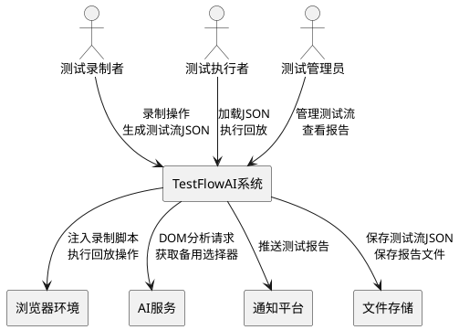
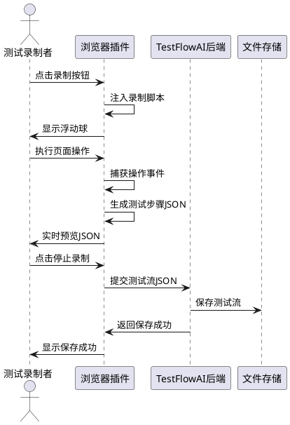
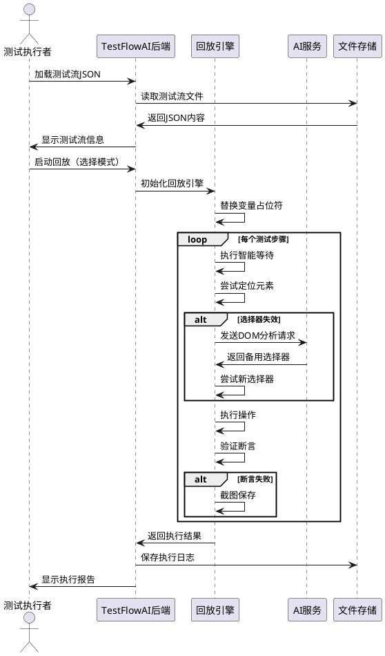
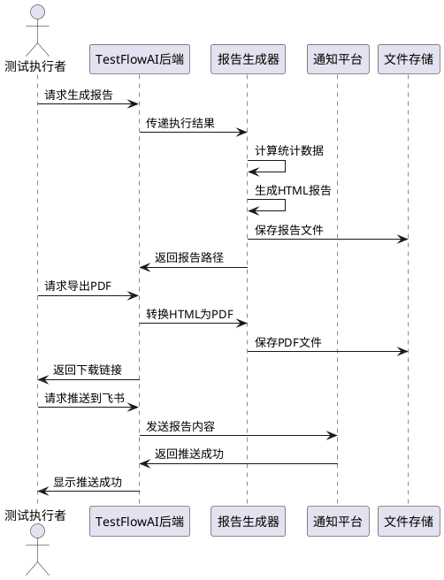
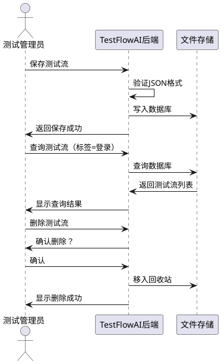
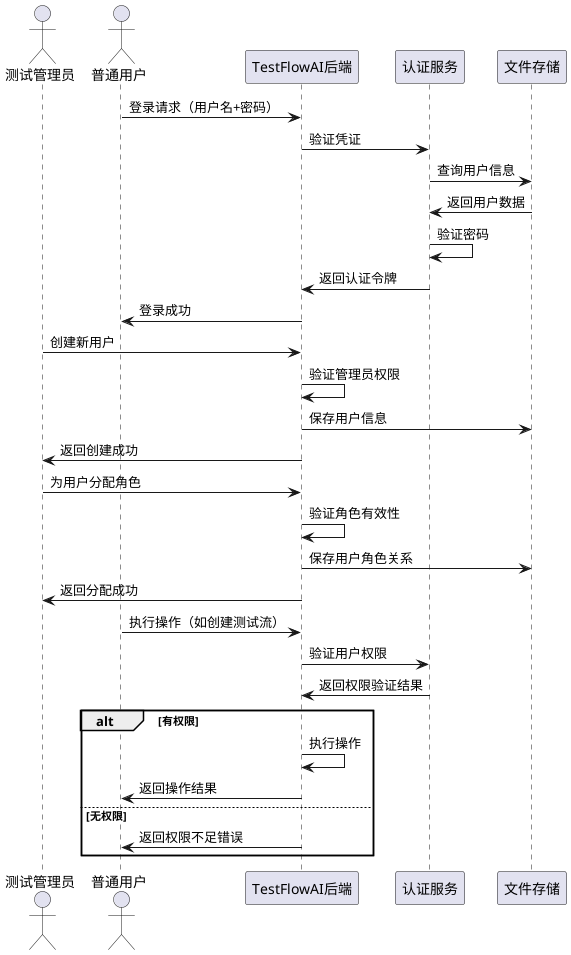

# TestFlowAI 需求规格文档

## 1. 组件定位

### 1.1 核心职责

本组件负责提供AI驱动的自动化测试录制、回放与报告生成能力，实现零代码测试自动化与智能自愈。

### 1.2 核心输入

1. **用户操作录制请求**：来自浏览器插件的录制启动/暂停/停止指令
2. **测试流JSON文件**：用户上传或编辑的标准测试流程定义
3. **回放执行请求**：用户触发的测试回放指令（含模式选择：有头/无头/慢速）
4. **AI分析请求**：选择器失效时的DOM结构分析请求
5. **报告生成请求**：测试完成后的报告导出指令

### 1.3 核心输出

1. **录制结果JSON**：保存到数据库的标准测试流JSON文件
2. **回放执行结果**：包含通过/失败状态、截图、日志的执行报告
3. **AI修复建议**：失效选择器的备用选择器列表
4. **测试报告**：HTML/PDF/JSON格式的标准化测试报告
5. **通知消息**：推送到Jira/飞书/企业微信的测试结果通知

### 1.4 职责边界

本组件**不负责**：
1. 被测应用的业务逻辑实现
2. CI/CD流水线的编排与调度
3. 测试环境的部署与维护
4. 性能测试与压力测试（仅支持功能回归测试）

---

## 2. 领域术语

**测试流（Test Flow）**
: 一组有序的测试步骤集合，以标准JSON格式存储，描述完整的用户操作场景。

**测试步骤（Test Step）**
: 测试流中的最小执行单元，包含操作类型、目标元素、输入值、断言条件等信息。

**选择器（Selector）**
: 用于定位页面元素的CSS选择器、XPath或文本选择器表达式。

**AI自愈（AI Self-Healing）**
: 当选择器失效时，系统通过AI分析DOM结构自动生成备用选择器并尝试执行的能力。

**智能等待（Smart Wait）**
: 系统自动判断页面加载状态、网络请求完成、元素可见性等条件后继续执行的能力。

**断言（Assertion）**
: 验证页面状态是否符合预期的检查点，如元素可见、文本包含、属性值匹配等。

**变量占位（Variable Placeholder）**
: 测试步骤中使用`{{variableName}}`格式的占位符，支持数据驱动测试。

**标签（Tag）**
: 用于对测试流进行分类和分组的标识符，便于报告分组展示。

**条件分支（Conditional Branch）**
: 根据页面状态或元素存在性决定执行路径的逻辑控制结构，支持if-else语法。

**循环控制（Loop Control）**
: 重复执行一组测试步骤的控制结构，支持固定次数循环和数据驱动循环。

**数据驱动（Data-Driven）**
: 使用外部数据集（CSV/JSON/数据库）驱动测试执行的能力，同一测试流可使用多组数据运行。

**用户（User）**
: 系统的使用者，具有唯一标识、用户名、密码、角色等属性，可登录系统并执行授权操作。

**角色（Role）**
: 权限的集合，代表用户在系统中的职能，如管理员、测试工程师、只读用户等。

**权限（Permission）**
: 对系统资源或操作的访问许可，如创建测试流、执行回放、查看报告、管理用户等。

**RBAC（Role-Based Access Control）**
: 基于角色的访问控制模型，用户通过分配角色获得相应权限，支持角色继承和权限组合。

**执行输入（Execution Input）**
: 回放执行时的输入参数，包括变量值、数据驱动数据集、环境配置等。

**执行输出（Execution Output）**
: 回放执行产生的输出结果，包括页面状态、提取的数据、截图、日志等。

---

## 3. 角色与边界

### 3.1 核心角色

- **测试录制者**：通过浏览器插件录制用户操作，生成测试流JSON
- **测试执行者**：加载测试流JSON并执行回放，查看执行结果
- **测试管理员**：管理测试流库、查看历史报告、配置系统参数

### 3.2 外部系统

- **浏览器环境**：Chrome/Edge浏览器，承载录制插件和回放引擎
- **AI服务**：Grok/Claude/通义千问等LLM API，提供选择器修复能力
- **通知平台**：Jira/飞书/企业微信，接收测试报告推送
- **文件存储**：本地文件系统或云存储，存储测试流JSON和报告文件

### 3.3 交互上下文

---

## 4. DFX约束

### 4.1 性能

1. **录制性能**：录制过程对页面性能影响不超过5%
2. **回放速度**：无头模式下单个步骤执行时间不超过3秒
3. **AI响应时间**：选择器修复请求响应时间不超过5秒
4. **报告生成**：100个测试用例的报告生成时间不超过10秒

### 4.2 可靠性

1. **系统可用性**：本地部署模式下系统可用性不低于99%
2. **数据持久化**：测试流JSON和报告文件必须持久化到本地数据库
3. **故障恢复**：回放中断后支持从断点继续执行

### 4.3 安全性

1. **敏感数据保护**：测试流中的密码等敏感数据支持加密存储
2. **访问控制**：支持基于角色的访问控制（管理员/普通用户）
3. **审计日志**：关键操作（录制、回放、删除）必须记录审计日志

### 4.4 可维护性

1. **日志规范**：所有模块必须输出结构化日志（JSON格式）
2. **监控指标**：必须暴露录制次数、回放次数、成功率等监控指标
3. **配置管理**：系统参数支持通过配置文件或环境变量配置

### 4.5 兼容性

1. **浏览器兼容**：支持Chrome 90+和Edge 90+
2. **JSON格式兼容**：测试流JSON格式兼容Chrome DevTools Recorder标准
3. **报告格式**：支持导出HTML、PDF、JSON三种格式

---

## 5. 核心能力

### 5.1 测试录制

#### 5.1.1 业务规则

1. **录制启动规则**：用户点击录制按钮后，系统必须注入录制脚本到当前页面
   - 验收条件：[用户点击录制按钮] → [页面注入录制脚本，浮动球显示]

2. **操作捕获规则**：录制脚本必须自动捕获用户的所有交互操作
   - 验收条件：[用户执行点击/输入/选择操作] → [操作被捕获并添加到步骤列表]

3. **步骤格式规则**：每个捕获的操作必须转换为标准JSON格式的测试步骤
   - 验收条件：[捕获到点击操作] → [生成包含type、selector、description的JSON步骤]

4. **多选择器规则**：系统必须为每个元素生成多个备用选择器
   - 验收条件：[捕获元素操作] → [生成CSS选择器、XPath、文本选择器组成的selectors数组]

5. **暂停继续规则**：录制过程支持暂停和继续，暂停期间不捕获操作
   - 验收条件：[用户点击暂停] → [停止捕获操作]；[用户点击继续] → [恢复捕获操作]

6. **步骤编辑规则**：录制过程中支持删除最后一个步骤或插入智能等待
   - 验收条件：[用户右键选择删除] → [移除最后一个步骤]

7. **标签标注规则**：支持为步骤或整个测试流添加标签
   - 验收条件：[用户输入标签"登录流程"] → [标签添加到测试流tags字段]

8. **禁止项**：录制脚本不得捕获密码输入框的明文内容
   - 验收条件：[用户在password类型输入框输入] → [记录为{{password}}占位符]

#### 5.1.2 交互流程

#### 5.1.3 异常场景

1. **页面跳转异常**
   - 触发条件：录制过程中页面发生跳转
   - 系统行为：自动保存当前测试流，提示用户是否继续录制
   - 用户感知：弹窗提示"页面已跳转，是否在新页面继续录制？"

2. **iframe切换异常**
   - 触发条件：操作发生在iframe内
   - 系统行为：记录iframe切换步骤，继续捕获iframe内操作
   - 用户感知：步骤列表显示"切换到iframe"步骤

3. **元素定位失败**
   - 触发条件：无法为操作元素生成有效选择器
   - 系统行为：记录警告日志，使用fallback选择器
   - 用户感知：步骤列表显示警告图标

---

### 5.2 测试回放

#### 5.2.1 业务规则

1. **JSON加载规则**：系统必须支持从文件或数据库加载测试流JSON
   - 验收条件：[用户选择测试流文件] → [解析JSON并验证格式]

2. **变量替换规则**：执行前必须替换所有变量占位符为实际值
   - 验收条件：[步骤包含{{username}}] → [使用variables中的值替换]

3. **智能等待规则**：每个步骤执行前必须自动插入智能等待
   - 验收条件：[步骤包含aiWait配置] → [等待networkIdle或elementVisible条件满足]

4. **选择器尝试规则**：元素定位失败时必须依次尝试备用选择器
   - 验收条件：[主选择器失效] → [尝试selectors数组中的备用选择器]

5. **AI修复规则**：所有选择器失效时必须调用AI服务生成新选择器
   - 验收条件：[所有选择器失效] → [发送DOM到AI服务，获取3个新选择器并尝试]

6. **断言验证规则**：步骤执行后必须验证assert条件
   - 验收条件：[步骤包含assert配置] → [验证元素可见/文本包含等条件]

7. **截图规则**：断言失败或配置screenshot:true时必须截图
   - 验收条件：[断言失败] → [保存当前页面截图]

8. **回放模式规则**：支持有头、无头、慢速三种回放模式
   - 验收条件：[选择无头模式] → [不显示浏览器界面执行]

9. **条件分支规则**：支持根据页面状态执行不同的测试路径
   - 验收条件：[步骤包含if条件] → [判断条件真假，执行对应分支的步骤]

10. **循环控制规则**：支持固定次数循环和数据驱动循环
   - 验收条件：[步骤包含loop配置] → [按指定次数或数据集大小重复执行步骤组]

11. **数据驱动规则**：支持从外部数据源加载测试数据
   - 验收条件：[配置dataSource] → [从CSV/JSON/数据库加载数据，每组数据执行一次测试流]

12. **循环上下文规则**：循环内步骤可访问当前迭代索引和数据项
   - 验收条件：[循环内步骤使用{{loop.index}}或{{loop.item}}] → [替换为当前迭代值]

13. **禁止项**：回放过程不得修改被测应用的实际数据（除非配置允许）
   - 验收条件：[测试流包含数据修改操作] → [提示用户确认]

#### 5.2.2 交互流程

#### 5.2.3 异常场景

1. **JSON格式错误**
   - 触发条件：加载的JSON文件格式不符合规范
   - 系统行为：拒绝加载，记录错误日志
   - 用户感知：提示"JSON格式错误，请检查文件"

2. **页面加载超时**
   - 触发条件：页面加载时间超过配置的超时时间
   - 系统行为：标记当前步骤失败，继续执行后续步骤
   - 用户感知：报告显示"步骤X失败：页面加载超时"

3. **AI服务不可用**
   - 触发条件：调用AI服务失败或超时
   - 系统行为：跳过AI修复，标记步骤失败
   - 用户感知：报告显示"AI服务不可用，选择器修复失败"

4. **网络请求失败**
   - 触发条件：等待的API响应未返回
   - 系统行为：等待超时后继续执行
   - 用户感知：报告显示"网络请求超时"

---

### 5.3 测试报告

#### 5.3.1 业务规则

1. **报告生成规则**：回放结束后必须自动生成测试报告
   - 验收条件：[回放完成] → [生成包含统计、详情、截图的报告]

2. **统计规则**：报告必须包含用例总数、通过数、失败数、平均耗时
   - 验收条件：[生成报告] → [显示总数/通过/失败/耗时统计]

3. **分组规则**：支持按标签分组生成多个报告
   - 验收条件：[测试流包含标签] → [按标签分组生成报告]

4. **历史对比规则**：支持与历史报告对比，高亮变化点
   - 验收条件：[选择历史报告对比] → [显示通过率变化趋势]

5. **导出规则**：支持导出HTML、PDF、JSON三种格式
   - 验收条件：[选择导出PDF] → [生成PDF格式报告文件]

6. **推送规则**：支持推送到Jira/飞书/企业微信
   - 验收条件：[配置推送渠道] → [自动推送报告到指定平台]

7. **禁止项**：报告不得包含敏感数据（密码等）
   - 验收条件：[生成报告] → [密码字段显示为******]

#### 5.3.2 交互流程

#### 5.3.3 异常场景

1. **报告生成失败**
   - 触发条件：报告模板缺失或渲染错误
   - 系统行为：生成简化版报告，记录错误日志
   - 用户感知：提示"报告生成失败，已生成简化版报告"

2. **推送失败**
   - 触发条件：通知平台接口调用失败
   - 系统行为：记录失败日志，支持手动重试
   - 用户感知：提示"推送到飞书失败，请检查配置"

---

### 5.4 测试流管理

#### 5.4.1 业务规则

1. **保存规则**：测试流JSON必须保存到本地数据库
   - 验收条件：[用户保存测试流] → [JSON存储到SQLite数据库]

2. **查询规则**：支持按名称、标签、时间范围查询测试流
   - 验收条件：[输入标签"登录"] → [返回所有包含该标签的测试流]

3. **版本管理规则**：支持测试流的版本管理，保留历史版本
   - 验收条件：[更新测试流] → [保留旧版本，创建新版本]

4. **删除规则**：删除测试流前必须确认，删除后移入回收站
   - 验收条件：[用户删除测试流] → [移入回收站，30天后永久删除]

5. **导入导出规则**：支持测试流的导入和导出（JSON文件）
   - 验收条件：[用户导出测试流] → [下载JSON文件]

#### 5.4.2 交互流程

#### 5.4.3 异常场景

1. **数据库写入失败**
   - 触发条件：SQLite数据库文件损坏或磁盘空间不足
   - 系统行为：记录错误日志，提示用户检查磁盘
   - 用户感知：提示"保存失败，请检查磁盘空间"

2. **JSON格式验证失败**
   - 触发条件：导入的JSON文件不符合规范
   - 系统行为：拒绝导入，返回详细错误信息
   - 用户感知：提示"JSON格式错误：缺少必填字段testId"

---

### 5.5 用户管理

#### 5.5.1 业务规则

1. **用户注册规则**：管理员必须能够创建新用户账户
   - 验收条件：[管理员提交用户信息] → [创建用户账户并分配默认角色]

2. **用户登录规则**：用户必须通过用户名和密码认证才能访问系统
   - 验收条件：[用户输入正确的用户名和密码] → [登录成功，生成会话令牌]

3. **密码安全规则**：密码必须加密存储，支持密码重置功能
   - 验收条件：[用户创建或修改密码] → [密码使用BCrypt加密存储]

4. **角色分配规则**：管理员必须能够为用户分配一个或多个角色
   - 验收条件：[管理员为用户分配角色] → [用户获得该角色的所有权限]

5. **权限验证规则**：系统必须在执行操作前验证用户权限
   - 验收条件：[用户执行需要权限的操作] → [检查用户角色是否包含该权限]

6. **角色继承规则**：支持角色之间的继承关系，子角色继承父角色的权限
   - 验收条件：[角色B继承角色A] → [角色B拥有角色A的所有权限]

7. **用户状态规则**：支持启用/禁用用户账户，禁用的用户无法登录
   - 验收条件：[管理员禁用用户] → [用户无法登录系统]

8. **审计日志规则**：用户的登录、权限变更等操作必须记录审计日志
   - 验收条件：[用户登录或权限变更] → [记录操作时间、用户、操作类型]

9. **禁止项**：普通用户不得修改自己的角色，不得删除管理员账户
   - 验收条件：[普通用户尝试修改角色] → [拒绝操作并提示权限不足]

#### 5.5.2 交互流程

#### 5.5.3 异常场景

1. **用户名已存在**
   - 触发条件：创建用户时用户名已被使用
   - 系统行为：拒绝创建，提示用户名冲突
   - 用户感知：提示"用户名已存在，请使用其他用户名"

2. **密码强度不足**
   - 触发条件：用户设置的密码不符合安全要求
   - 系统行为：拒绝密码设置，返回密码规则
   - 用户感知：提示"密码必须包含大小写字母、数字，长度至少8位"

3. **权限不足**
   - 触发条件：用户尝试执行未授权的操作
   - 系统行为：拒绝操作，记录审计日志
   - 用户感知：提示"权限不足，请联系管理员"

4. **账户被禁用**
   - 触发条件：被禁用的用户尝试登录
   - 系统行为：拒绝登录，记录审计日志
   - 用户感知：提示"账户已被禁用，请联系管理员"

---

## 6. 数据约束

### 6.1 测试流（TestFlow）

1. **testId**：测试流唯一标识，格式为`{功能名}_{版本}_{日期}`，如`login_v2_20260321`
2. **title**：测试流标题，长度不超过100字符
3. **version**：版本号，格式为`主版本.次版本`，如`1.2`
4. **appUrl**：被测应用URL，必须是有效的HTTP/HTTPS地址
5. **steps**：测试步骤数组，至少包含1个步骤
6. **variables**：变量定义对象，键为变量名，值为变量值
7. **tags**：标签数组，每个标签长度不超过20字符
8. **expectedReport**：预期报告配置，包含totalCases和group字段

### 6.2 测试步骤（TestStep）

1. **stepId**：步骤唯一标识，从1开始递增
2. **type**：操作类型，枚举值为`navigate|type|click|select|scroll|upload|hover|wait|assert|if|loop`
3. **selector**：主选择器，CSS选择器或XPath表达式
4. **selectors**：备用选择器数组，至少包含1个选择器
5. **value**：输入值，对于type操作为输入文本，对于select操作为选项值
6. **description**：步骤描述，长度不超过200字符
7. **aiWait**：智能等待配置，包含type和timeout字段
8. **assert**：断言配置，包含type、selector、text等字段
9. **assertAfter**：步骤后断言配置
10. **aiCondition**：AI条件，如`waitForResponse('/api/login')`
11. **if**：条件分支配置，包含condition、thenSteps、elseSteps字段
12. **loop**：循环配置，包含count或dataSource、steps字段

### 6.3 条件分支配置（IfCondition）

1. **condition**：条件表达式，支持`elementExists(selector)`、`elementVisible(selector)`、`textContains(selector, text)`等
2. **thenSteps**：条件为真时执行的步骤数组
3. **elseSteps**：条件为假时执行的步骤数组（可选）

### 6.4 循环配置（LoopConfig）

1. **count**：固定循环次数，正整数
2. **dataSource**：数据源配置，包含type（csv/json/database）、path或query字段
3. **steps**：循环体内执行的步骤数组
4. **maxIterations**：最大迭代次数限制，防止无限循环，默认100

### 6.5 数据源配置（DataSource）

1. **type**：数据源类型，枚举值为`csv|json|database|inline`
2. **path**：文件路径（CSV/JSON类型）
3. **query**：数据库查询语句（database类型）
4. **data**：内联数据数组（inline类型）
5. **variables**：变量映射配置，将数据列映射到变量名

### 6.6 执行结果（ExecutionResult）

1. **testId**：关联的测试流ID
2. **executionId**：执行唯一标识，UUID格式
3. **startTime**：执行开始时间，ISO 8601格式
4. **endTime**：执行结束时间，ISO 8601格式
5. **status**：执行状态，枚举值为`passed|failed|partial`
6. **totalSteps**：总步骤数
7. **passedSteps**：通过步骤数
8. **failedSteps**：失败步骤数
9. **stepResults**：每个步骤的执行结果数组
10. **screenshots**：截图文件路径数组
11. **loopContext**：循环上下文信息，包含当前索引和数据项
12. **input**：执行输入参数，包含变量值、数据驱动数据集、环境配置
13. **output**：执行输出结果，包含提取的数据、页面最终状态、关键日志

### 6.7 执行输入（ExecutionInput）

1. **variables**：变量值映射，键为变量名，值为实际值
2. **dataSource**：数据驱动数据源配置（可选）
3. **environment**：环境配置，如浏览器类型、设备类型、网络条件等
4. **options**：执行选项，如超时时间、重试次数、截图策略等

### 6.8 执行输出（ExecutionOutput）

1. **extractedData**：从页面提取的数据对象，键为数据名称，值为提取值
2. **finalState**：页面最终状态，包含URL、标题、关键元素状态
3. **logs**：执行过程的关键日志数组
4. **metrics**：性能指标，如总耗时、网络请求数、页面加载时间等
5. **errors**：错误信息数组，包含错误类型、错误消息、发生时间

### 6.9 用户（User）

1. **userId**：用户唯一标识，UUID格式
2. **username**：用户名，长度4-20字符，仅允许字母、数字、下划线
3. **password**：加密后的密码，使用BCrypt算法
4. **email**：用户邮箱，必须是有效的邮箱格式
5. **roles**：用户角色列表，至少包含一个角色
6. **status**：用户状态，枚举值为`active|disabled`
7. **createdAt**：创建时间，ISO 8601格式
8. **updatedAt**：更新时间，ISO 8601格式
9. **lastLoginAt**：最后登录时间，ISO 8601格式（可选）

### 6.10 角色（Role）

1. **roleId**：角色唯一标识，UUID格式
2. **roleName**：角色名称，如`admin`、`test_engineer`、`viewer`
3. **displayName**：角色显示名称，如"管理员"、"测试工程师"、"只读用户"
4. **permissions**：权限列表，包含权限代码数组
5. **parentRoles**：父角色列表，支持角色继承（可选）
6. **description**：角色描述，长度不超过200字符
7. **createdAt**：创建时间，ISO 8601格式

### 6.11 权限（Permission）

1. **permissionId**：权限唯一标识，UUID格式
2. **permissionCode**：权限代码，格式为`资源:操作`，如`testflow:create`、`report:view`
3. **permissionName**：权限名称，如"创建测试流"、"查看报告"
4. **resource**：资源类型，如`testflow`、`report`、`user`、`role`
5. **action**：操作类型，枚举值为`create|read|update|delete|execute`
6. **description**：权限描述，长度不超过200字符

### 6.12 审计日志（AuditLog）

1. **logId**：日志唯一标识，UUID格式
2. **userId**：操作用户ID
3. **username**：操作用户名
4. **operation**：操作类型，如`login`、`create_user`、`assign_role`、`delete_testflow`
5. **resource**：操作资源类型
6. **resourceId**：操作资源ID（可选）
7. **details**：操作详情，JSON格式
8. **ipAddress**：操作IP地址
9. **timestamp**：操作时间，ISO 8601格式
10. **result**：操作结果，枚举值为`success|failure`

### 6.13 测试报告（TestReport）

1. **reportId**：报告唯一标识，UUID格式
2. **testId**：关联的测试流ID
3. **executionId**：关联的执行ID
4. **generatedAt**：报告生成时间，ISO 8601格式
5. **summary**：报告摘要，包含totalCases、passed、failed、avgDuration
6. **details**：详细结果列表
7. **comparisons**：历史对比数据（可选）
8. **format**：报告格式，枚举值为`html|pdf|json`
